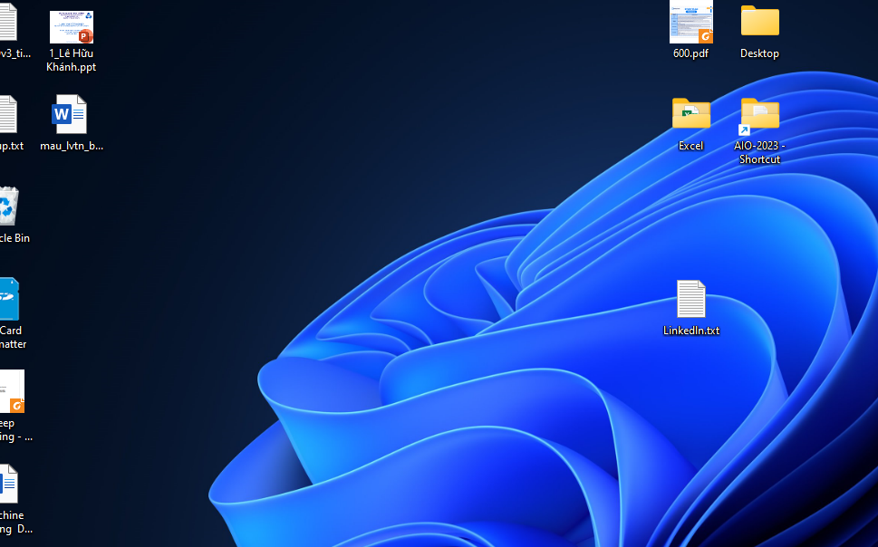

# GẠCH NGANG (***)
***
# HEADING 
## Heading 1
#### Heading 2
##### Heading 3
###### Heading 4
Còn đây là không dùng heading
***
# QUOTATION
> Line1
> Line2
> Line 3
> Lê Hữu Khánh 872000

***
# FONTS + TẠO BẢNG
Canh lề bằng dấu ":"
|Font|Cách tạo|Kết quả|
|---|------------------------|----------|
|Đậm|2 dấu * trc và sau từ đó|**oke la**|
|Nghiêng|1 dấu * trc và sau từ đó|*oke la*|
|Đậm + nghiêng|3 dấu * trc và sau từ đó|***oke la***|
|Gạch bỏ|2 dấu ~ trc và sau từ đó|~~delete~~|
|Giữ lại * _|dùng \ |\*  \_|
***
# CODE BLOCK
Sử dụng TAB + ENTER

    class OOP:
        print("Đây là ví dụ cho CodeBlock")
***
# CHÈN LINK
Bằng dấu ngoặc []
Hoặc chèn bằng cách này cho chuyên nghiệp khi link đến [xem video][1] và nhớ cách ít nhất 1 dòng trống

[1]: <https://www.youtube.com/>
***
# CHÈN HÌNH ẢNH
